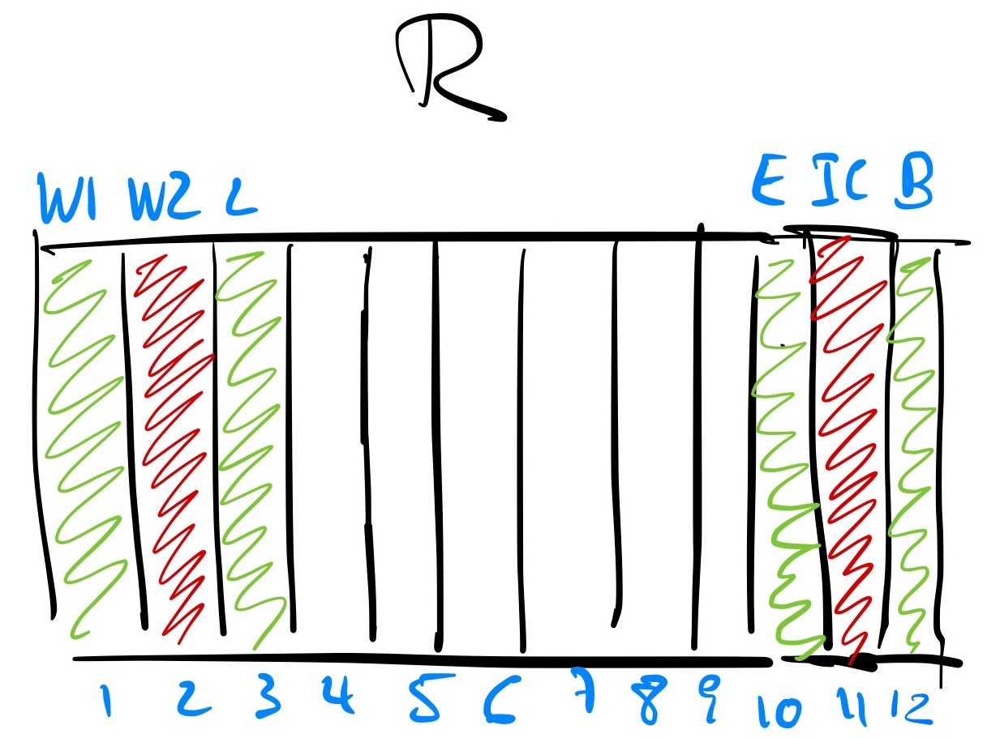
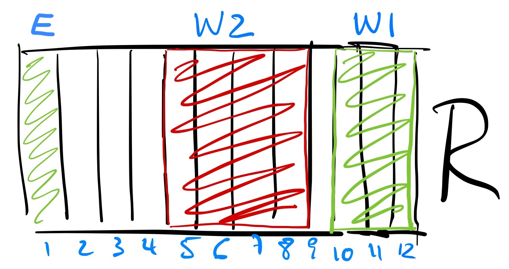
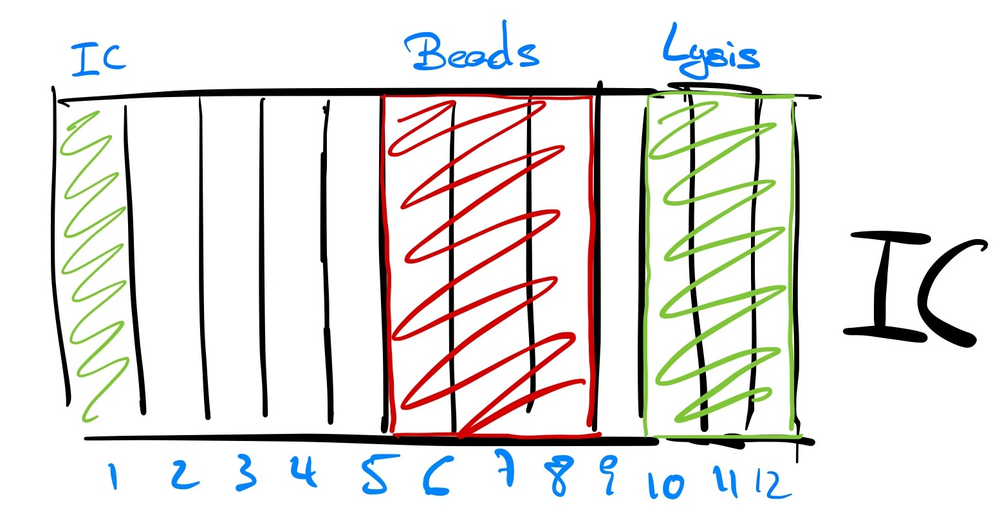

**Volumes**

This file shows the volumes needed to run the KF Protocols in HUC

**VIRAL**
|W1|W2|Lysis| | | | | | |Elution|IC|Beads|
|:-:|:-:|:-:|:-:|:-:|:-:|:-:|:-:|:-:|:-:|:-:|:-:|
|6000|6000|6000| | | | | | |1800|1600|1800|

**PATHOGEN      well R**
|W1|W2|Lysis| | | | | | |Elution|IC|Beads|
|:-:|:-:|:-:|:-:|:-:|:-:|:-:|:-:|:-:|:-:|:-:|:-:|
|6000|6000|6000| | | | | | |1800|1600|1800|

**PATHOGEN      well IC**
|W1|W2|Lysis| | | | | | |Elution|IC|Beads|
|:-:|:-:|:-:|:-:|:-:|:-:|:-:|:-:|:-:|:-:|:-:|:-:|
|6000|6000|6000| | | | | | |1800|1600|1800|

